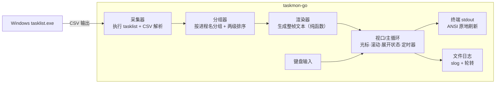

# taskmon-go 复刻规格说明书/SPEC

| 项 | 内容 |
|---|---|
| 文档目的 | 读者**从未见过原实现**，仅凭本文档即可用 Go 完整复刻 taskmon 的全部功能 |
| 读者 | 熟悉 Go 与 Windows 的开发工程师 |
| 状态 | 已定稿（v1.0） |
| 复刻目标版本 | taskmon v0.2.0 行为规格 |
| 范围 | 第一期：完整 CLI/TUI/日志功能；数据源固定为 `tasklist` 命令（见 1.3 Non-Goals） |

---

## 1. 产品概述

### 1.1 一句话定位

**Windows 任务管理器·内存版**：控制台实时查看进程内存占用，同名进程按进程名分组展示，原地刷新无闪烁，支持键盘交互（光标选择、展开/收起、视口滚动）。

### 1.2 三种运行模式

| 模式 | 触发条件 | 行为 |
|---|---|---|
| TUI 交互模式 | 未指定 `--once`，且 stdout 是终端（TTY） | 全屏接管终端，周期刷新，响应键盘 |
| 单帧快照模式 | 指定 `--once` | 采集一次，输出一帧后退出（退出码 0/1） |
| 管道模式 | stdout 不是 TTY（重定向/管道），且未指定 `--once` | **自动降级**为单帧快照模式（行为同 `--once`） |

### 1.3 Non-Goals（明确不做）

- 不做跨平台：仅支持 Windows（数据源是 Windows 内置命令）。
- 不做 GUI：只有控制台版。
- 不做 CPU / 磁盘 / 网络指标：只做内存（工作集）。
- 第一期不引入系统 API 直读方案（gopsutil 等），数据源固定 `tasklist` 子进程；此为第二期迭代内容（见 15 章）。

---

## 2. CLI 规格

### 2.1 参数表

| 参数 | 说明 | 默认值 | 解析规则 |
|---|---|---|---|
| `-i, --interval <seconds>` | 刷新间隔（秒） | `2` | 解析为数字；**解析失败（非数字/空）→ 2**；然后钳制最小值 1（`max(1, v)`）；允许小数（如 `-i 0.5` → 实际 1，`-i 1.5` → 1.5s） |
| `-t, --top <n>` | 只显示内存最大的前 n 组 | `0` | 解析为数字；解析失败 → 0；**向下取整**；负数 → 0；`0` 表示显示全部 |
| `-e, --expand` | 启动时展开全部多实例分组 | 关闭 | 布尔开关，无值 |
| `--once` | 输出一帧快照后退出 | 关闭 | 布尔开关 |
| `-V, --version` | 显示版本号 | - | 输出版本字符串后退出 0。版本来源见 12.3：构建时注入；`go run` 直跑时显示 `dev` |
| `-h, --help` | 显示帮助 | - | 输出参数帮助后退出 0 |

程序名固定为 `taskmon`；帮助文本需包含程序描述：「Windows 任务管理器·内存版：按进程名分组展示内存占用，控制台实时刷新」。

> 兼容性说明：参数形式接受 `-i 3`、`-i=3`、`--interval 3`；不要求兼容 `-i3` 连写。

### 2.2 退出码

| 场景 | 退出码 |
|---|---|
| TUI 正常退出（`q` / `Ctrl+C` / `SIGINT`） | 0 |
| 单帧/管道模式采集成功 | 0 |
| 单帧/管道模式采集失败 | 1 |
| TUI 运行中采集失败 | **不退出**，显示错误帧，等待下一轮刷新自动恢复 |

---

## 3. 总体架构

### 3.1 数据流



### 3.2 模块职责

| 模块 | 职责（一句话） |
|---|---|
| collect | 执行 `tasklist /fo csv /nh`，把输出文本解析为进程列表；超时/执行失败返回错误 |
| grouping | 把进程列表按名字分组，组内/组间排序 |
| format | 显示宽度、对齐填充、截断、字节人性化、内存条（纯函数工具集） |
| render | 给定分组数据 + 渲染选项，输出整帧行数组与组行下标（**纯函数**，不做 IO） |
| tui | 主循环：定时采集、键盘事件、光标/视口/展开状态、终端控制序列、绘制 |
| logging | 文件日志初始化与轮转 |

**关键设计约束**：render 必须实现为纯函数（输入数据 + 选项 → 行数组），不接触终端。这使渲染可以单测，也使 TUI/单帧两种模式复用同一渲染器。

---

## 4. 数据采集规格

### 4.1 执行命令

```
tasklist /fo csv /nh
```

- 以子进程执行，**不弹出控制台窗口**（Windows `CREATE_NO_WINDOW`）。
- 超时 **15 秒**，超时视为采集失败。
- stdout 需能容纳至少 8MB 输出（进程数多时 CSV 较大；Go 直接流式读取即可）。

### 4.2 tasklist CSV 输出格式

`/fo csv /nh` 输出每行一个进程、无表头，字段带双引号，逗号分隔，共 5 列：

```
"chrome.exe","1234","Console","1","84,528 K"
```

| 列下标 | 含义 | 用途 |
|---|---|---|
| 0 | 镜像名（含扩展名） | 分组键 |
| 1 | PID | 显示 |
| 2 | 会话名 | 忽略 |
| 3 | 会话号 | 忽略 |
| 4 | 内存使用（工作集） | 显示，如 `84,528 K` / `N/A` |

### 4.3 CSV 行解析规则

逐字符状态机（等价 RFC 4180 的引号规则）：

1. 按 `\r\n` 或 `\n` 分行；每行**先 trim 首尾空白**，空行跳过。
2. 字段解析：默认态遇 `,` 结束当前字段；遇 `"` 进入引号态；引号态内 `""`（两个连续双引号）转义为一个字面 `"`；单个 `"` 结束引号态；引号态内的 `,` 属于字段内容。
3. **字段数 < 5 的行跳过**。
4. 字段 0 trim 后为空 → 跳过；字段 1 解析为十进制整数失败 → 跳过。
5. 产出 `ProcessInfo{name, pid, memBytes}`，其中 `memBytes` 来自字段 4。

解析样例：

| 输入行 | 输出 |
|---|---|
| `"chrome.exe","1234","Console","1","84,528 K"` | `{chrome.exe, 1234, 86536192}` |
| `"weird, name.exe","77","Console","1","N/A"` | `{weird, name.exe, 77, 0}` |
| `"a,b","c""d","e"`（仅 3 字段） | 跳过（字段数不足） |

### 4.4 内存字段解析规则

对字段 4（如 `"84,528 K"`）：

1. 用正则 `([\d.,]+)\s*K`（**大小写不敏感**）匹配；不匹配（含 `N/A`、空串）→ 返回 `0`。
2. 取捕获组，剔除所有非数字字符（去掉千分位逗号与小数点），得到整数字符串。
3. 空串 → 返回 `0`；否则 `parseInt` 成功 → **KB × 1024 = 字节数**；解析失败 → `0`。

用例：

| 输入 | 输出（字节） |
|---|---|
| `84,528 K` | 84528 × 1024 = 86,536,192 |
| `1,234,567 K` | 1,234,567 × 1024 |
| `8 K` | 8 × 1024 |
| `N/A` | 0 |
| `""`（空） | 0 |

### 4.5 编码（OEM 代码页）

`tasklist` 的 stdout 是**本地 OEM 代码页**编码（中文系统为 cp936/GBK）。第一期**按字节透传、以 UTF-8 解释**：ASCII 进程名（绝大多数）完全正常；非 ASCII 进程名可能乱码——**这是与原版一致的已知限制**（见 14 章）。

> 可选增强（一期不做也不影响验收）：调用 `GetOEMCP()` 取系统 OEM 页，用 `golang.org/x/text/encoding` 解码后再解析，可消除乱码。二期随数据源切换一并解决。

---

## 5. 数据模型与分组算法

### 5.1 数据结构

```
ProcessInfo {
  name      string   // 镜像名（含扩展名），如 chrome.exe
  pid       int
  memBytes  int64    // 工作集内存（字节）
}

ProcessGroup {
  name           string
  processes      []ProcessInfo   // 组内按 memBytes 降序（稳定排序）
  totalBytes     int64           // 组内 memBytes 之和
  maxSingleBytes int64           // 组内最大单进程内存（= processes[0].memBytes）
}
```

### 5.2 分组算法

1. 按进程名分组（相同 `name` 归一组），保留**首次出现顺序**作为并列名次时的次序。
2. 每组：组内按 `memBytes` **降序**（**必须用稳定排序**，并列时保持采集顺序）；计算 `totalBytes`、`maxSingleBytes`。
3. 组间按 `totalBytes` **降序**（**必须用稳定排序**，并列时按首次出现顺序）。

用例：

| 输入（name, pid, MB） | 输出组序 / 组内序 |
|---|---|
| a.exe(1,10), a.exe(2,20), b.exe(3,100) | 组序 `[b.exe, a.exe]`；a.exe 组内 `[pid2(20), pid1(10)]`，total=30MB |
| a.exe×3 各10, b.exe(4,100), c.exe(5,5) | 组序 `[b.exe(100), a.exe(30), c.exe(5)]` |
| a.exe(101,5), a.exe(102,30), a.exe(103,20) | 组内 `[102, 103, 101]`，maxSingle=30MB |
| 空列表 | 空数组 |

---

## 6. 渲染规格（核心）

渲染器是纯函数：`(所有分组, 渲染选项) → 帧{lines[], groupRows[]}`。

- `lines`：整帧的行数组（**只含内容区**，不含视口切片与底部状态行）。
- `groupRows[i]`：第 i 个**可见组**的组行在 `lines` 中的下标（展开的组会插入成员行，因此组行下标不连续）。

### 6.1 渲染选项

| 选项 | 类型 | 说明 |
|---|---|---|
| width | int | 终端列数；**钳制到 [72, 300]** |
| top | int | 只取前 top 组（0=全部）；**摘要、分组计数、内存合计始终基于全量数据** |
| timestamp | time | 采集时刻，本地时间 |
| intervalSec | number | 刷新间隔（显示用） |
| totalProcs | int | 进程总数（采集到的原始条数） |
| expanded | set\<string> | 已展开的组名集合 |
| expandAll | bool | 无视 expanded 集合直接展开全部（单帧模式 `-e` 用） |
| cursorIndex | int? | 光标所在可见组序号；**TUI 模式才传，单帧/管道不传** |

### 6.2 列布局常量与动态列宽

固定常量：

| 常量 | 值 | 含义 |
|---|---|---|
| RANK_W | 3 | 排名列宽（右对齐） |
| PID_W | 6 | PID 列宽（右对齐） |
| MEM_W | 10 | 内存列宽（右对齐） |
| PCT_W | 7 | 组内%列宽（右对齐） |
| GAP | 2 | 列间空隙（两个空格） |
| IND_W | 2 | 展开指示符占位（`▸ `/`▾ `/两空格） |

动态列宽（按可见组集合计算）：

```
nameW   = clamp(18, 40, max over 可见组: displayWidth(name) + (多实例 ? len(" (N)") : 0))
nameColW = nameW + IND_W
barW    = clamp(8, 40, width - (RANK_W + PID_W + MEM_W + PCT_W + GAP×5 + nameColW))
```

组行总列数 = RANK_W + GAP + nameColW + GAP + PID_W + GAP + MEM_W + GAP + PCT_W + GAP + barW。

### 6.3 帧结构（逐行）

帧的行序：

1. **标题行**：`taskmon · 内存监控`（bold+cyan），按显示宽度 padEnd 到 `width - displayWidth(时间串)`，随后拼接时间串（dim）。时间格式 `YYYY-MM-DD HH:MM:SS`（本地时间，各段两位补零）。
2. **摘要行**（普通色打底，数值 bold，分隔符 ` · ` dim）：
   `进程 <totalProcs> · 分组 <全部分组数> · 内存合计 <全部分组总内存> · 刷新 <intervalSec>s`
   当 `top > 0` 时再拼接（dim）：` · 前 <可见组数> 组`
3. **分隔线**：`-` × width（dim）。
4. **空数据**：可见组数为 0 时，输出黄色 `未捕获到任何进程`，帧结束，`groupRows = []`。
5. **列头行**（整行 bold）：

   ```
   右对齐("#",3) GAP 左对齐("  进程 / 组",nameColW) GAP 右对齐("PID",6)
   GAP 右对齐("内存",10) GAP 右对齐("组内%",7) GAP 左对齐("分布",barW)
   ```

   注意：名称列头的文本固定为「两空格 + `进程 / 组`」（两空格对应 IND_W 占位）。
6. **组行 × N**（见 6.4），**相邻两组之间插一个空行**（最后一组之后不加）。

### 6.4 组行与成员行

**组行**（i 为可见组序号，从 0 起）：

| 列 | 内容 |
|---|---|
| 排名 | `i+1` 右对齐 RANK_W，dim |
| 名称 | `padEnd(ind + truncate(label, nameW), nameColW)`；`label` = 多实例时 `name (N)`，否则 `name`；`ind` = 多实例 ? （展开 ? `▾ ` : `▸ `） : 两空格；**多实例时整列 bold**，单实例普通色 |
| PID | 多实例：PID_W 个空格；单实例：唯一 PID 右对齐 PID_W，dim |
| 内存 | `formatBytes(totalBytes)` 右对齐 MEM_W，**bold + 组档位色** |
| 组内% | PCT_W 个空格（组行恒空） |
| 分布 | 内存条（见 6.6），宽 barW |

光标行：若 `cursorIndex == i`，**整行再包一层 inverse**（在全部颜色序列之外：`ESC[7m` + 整行 + `ESC[0m`）。

**成员行**（仅当多实例且该组展开时，跟在组行后，每个进程一行）：

```
RANK_W空格 GAP nameColW空格 GAP dim(右对齐PID,PID_W) GAP 右对齐(formatBytes(memBytes),MEM_W)
GAP dim(右对齐("组内占比.toFixed(1)%",PCT_W))
```

- `组内占比 = totalBytes > 0 ? memBytes / totalBytes × 100 : 0`，**保留 1 位小数**。
- 成员行**没有分布列**；成员按组内降序排列（继承分组结果）。

### 6.5 颜色档位（内存分级）

按组 `totalBytes`：

| 条件 | 颜色 | SGR |
|---|---|---|
| ≥ 1 GiB（1024³） | red | `ESC[31m` |
| ≥ 256 MiB | yellow | `ESC[33m` |
| 其他 | green | `ESC[32m` |

档位色用于：组行内存数字、内存条实心段。

### 6.6 内存条

```
ratio  = maxTotal > 0 ? totalBytes / maxTotal : 0        // maxTotal = 可见组中最大 totalBytes
filled = round(clamp(ratio, 0, 1) × barW)
bar    = '█' × filled + '░' × (barW - filled)
```

着色：`filled > 0` 时实心段用组档位色，空心段恒 dim；`filled == 0` 时整条 dim（无色实心段）。

### 6.7 ANSI 样式码表

| 样式 | SGR 码 |
|---|---|
| bold | `ESC[1m` |
| dim | `ESC[2m` |
| inverse | `ESC[7m` |
| red / green / yellow / cyan | `ESC[31m` / `ESC[32m` / `ESC[33m` / `ESC[36m` |
| 复位 | `ESC[0m` |

组合样式（如 bold+cyan）可用合并写法 `ESC[1;36m`，与嵌套写法等价；每段样式结束后必须复位。cyan 仅用于标题行。

### 6.8 文本格式化函数（必须逐条实现）

**displayWidth(s)**：终端显示宽度。

1. 先剔除 ANSI 序列（正则 `ESC[[0-9;]*m`）。
2. 逐字符（按 Unicode 码点）累加：落在下列区间按宽 2，否则宽 1：
   `U+1100–115F, U+2E80–A4CF, U+A960–A97F, U+AC00–D7A3, U+F900–FAFF, U+FE10–FE19, U+FE30–FE6F, U+FF00–FF60, U+FFE0–FFE6`
   （CJK/全角/韩文等宽字符区间）。

用例：`chrome.exe`→10；`内存`→4；`a中b`→4；`ESC[1mabcESC[0m`→3。

**padEnd(s, w) / padStart(s, w)**：按**显示宽度**在右/左侧补空格到 w；已超宽则原样返回。

用例：`padEnd("中文",6)="中文  "`；`padStart("内存",5)=" 内存"`。

**truncate(s, maxW)**：超宽截断。

1. `displayWidth(s) <= maxW` → 原样返回。
2. 否则逐字符累加显示宽度，当 `已宽 + 当前字符宽 > maxW - 2` 时停止，输出已累积字符 + `..`。

用例：`truncate("abcdefgh",5)="abc.."`；`truncate("abc",5)="abc"`；`truncate("中文字符",6)="中文.."`。

**formatBytes(bytes)**：字节人性化，1024 进制。

1. `bytes <= 0` 或非有限 → 返回字符串 `"0"`。
2. 单位序列 `B, KB, MB, GB, TB`；`v >= 1024` 则 `v /= 1024` 进位（TB 封顶）。
3. 小数位自适应：`v >= 100` → 0 位；`v >= 10` → 1 位；否则 2 位（**四舍五入固定小数位**）。
4. 输出 `<v> <unit>`（一个空格分隔）。

用例：`0→"0"`；`8KB→"8.00 KB"`；`84528KB→"82.5 MB"`；`1.5GB→"1.50 GB"`；`512MB→"512 MB"`。

**bar(filled, width)**：`'█'×clamp(filled,0,width) + '░'×(width-filled)`。用例：`bar(2,4)="██░░"`；`bar(10,3)="███"`。

### 6.9 渲染示例帧

输入：chrome.exe(pid111, 300MB) + chrome.exe(pid222, 200MB) + explorer.exe(pid333, 50MB)，width=100，展开 chrome 组，其余默认。去掉颜色后的结构示意（**列宽以 6.2 公式为准，此处为示意**）：

```
taskmon · 内存监控                                              2026-01-01 12:00:00
进程 3 · 分组 2 · 内存合计 550 MB · 刷新 2s
----------------------------------------------------------------------------------------------------
  #   进程 / 组                 PID      内存   组内%  分布
  1   ▾ chrome.exe (2)                          500 MB   ████████████████████████████████████████
        111                            300.0 MB    60.0%
        222                            200.0 MB    40.0%

  2     explorer.exe             333      50.0 MB   ████░░░░░░░░░░░░░░░░░░░░░░░░░░░░░░░░░░░░░
```

- chrome 组因展开，组行前缀是 `▾ `，其后跟两行成员（300MB 在前）；explorer 是单实例，无指示符、PID 直接显示在组行、无成员行。
- 折叠状态时 chrome 组行前缀为 `▸ `，且**没有成员行**。

---

## 7. TUI 交互规格

### 7.1 主循环

```
启动 → 清屏/隐藏光标 → 立即执行一次 tick → 循环等待（键盘事件 或 interval 定时器）
tick = { 采集 → 分组 → 更新数据/时间戳/清除错误 →（首次成功时应用 -e 初始展开）→ draw → 若仍在运行，重设 interval 定时器 }
```

- 采集失败：进入错误状态（见 10.1），**不中断循环**，下一轮 tick 自动重试。
- 键盘「立即刷新」：取消挂起的定时器，立刻执行 tick。
- 终端 resize 事件：立即重新 draw（用新宽高，不重新采集）。

### 7.2 状态变量

| 变量 | 初始值 | 说明 |
|---|---|---|
| cursor | 0 | 光标所在**可见组**序号 |
| offset | 0 | 视口首行在帧中的下标 |
| expandedNames | 空 | 已展开组名集合（默认全折叠） |
| expandInitialized | false | `-e` 初始展开是否已应用 |

**`-e` 的确切语义**：仅在**第一次采集成功**时，把当时全部**多实例**组名加入 expandedNames，此后不再自动维护（后续新出现的多实例组默认仍折叠）。

### 7.3 键位表

| 键 | 行为 |
|---|---|
| `↑` / `↓` | cursor ±1 后 draw（draw 内钳制） |
| `PgUp` / `PgDn` | cursor ±（**当前视口内可见的组行数**，最少 1）后 draw |
| `Home` | cursor = 0，draw |
| `End` | cursor 置极大值（draw 内钳制到最后一组），draw |
| `Enter` | 切换当前组的展开/收起（仅多实例有效），draw |
| `→` 或 `+` | 展开当前组；`←` 或 `-` 收起当前组（仅多实例有效），draw |
| `a` | 全部展开 / 全部收起（见下），draw |
| 空格 或 `r` | 立即刷新（取消定时器 + 立刻 tick） |
| `q` | 退出 |
| `Ctrl+C` | 退出（raw 模式下 SIGINT 被禁用，必须在按键解析层识别） |

**`a` 的语义**：作用于 **top 过滤后的可见多实例组**；若这些组**当前全部已展开** → 全部收起；否则 → 全部展开。

**展开/收起对单实例组无效**（组行无指示符，也没有可展开内容）。

### 7.4 视口与绘制算法

每帧 draw：

```
body     = max(4, 终端行数 - 1)            // 内容区行数，最少 4；终端行数未知时按 40
maxOffset = max(0, len(lines) - body)
若 groupRows 非空：
  cursor = clamp(cursor, 0, len(groupRows)-1)          // 光标钳制
  cursorRow = groupRows[cursor]
  若 cursorRow < offset            → offset = cursorRow            // 视口上移跟随
  若 cursorRow > offset + body - 1 → offset = cursorRow - body + 1  // 视口下移跟随
offset = clamp(offset, 0, maxOffset)
rows = lines[offset : offset+body]，不足 body 行则补空行至 body 行
```

**底部状态行**（追加在 rows 之后，共输出 body+1 行，恰好占满终端不滚动）：

```
片段 = []
若 offset > 0                → 片段 += "↑ 上方还有 {offset} 行"
若 maxOffset - offset > 0    → 片段 += "↓ 下方还有 {maxOffset-offset} 行"
片段 += "↑↓ 选择 · Enter 展开/收起 · a 全部展开/收起 · 空格 刷新 · q 退出"
状态行 = dim( truncate( 片段用三个空格连接 , width) )
```

绘制输出（单次 write，见 8.2）。

### 7.5 错误帧

采集失败期间，帧内容替换为（`groupRows = []`，视口逻辑跳过）：

```
采集进程数据失败            ← red + bold

<错误消息原文>              ← red

提示：taskmon 依赖 Windows 内置命令 tasklist，请在 Windows 上运行。   ← yellow
```

错误消息来自子进程执行错误（如「可执行文件不存在」、超时等）。成功采集后自动恢复正常帧。

### 7.6 终端宽度默认值

| 场景 | 宽度 | 说明 |
|---|---|---|
| TUI 模式 | 终端实际列数，取不到按 **100** | |
| 单帧/管道模式 | 终端实际列数，取不到按 **120** | |

---

## 8. 终端控制规格

### 8.1 控制序列清单

| 时机 | 序列 | 作用 |
|---|---|---|
| TUI 启动 | `ESC[2J ESC[3J ESC[H ESC[?25l` | 清屏（含滚动缓冲区）+ 光标回家 + 隐藏光标 |
| 每帧绘制 | `ESC[H` + 每行 `行内容 + ESC[K`，行间以 `\n` 连接，末尾再补一个 `ESC[K` | 光标回家 + 逐行清除行尾，原地刷新无闪烁 |
| 退出开始 | `ESC[?25h` | 恢复光标可见 |
| 退出清屏 | `ESC[2J ESC[3J ESC[H` | 清屏后光标回家 |

### 8.2 原地刷新要点

- 每帧**一次性输出**全部行（拼成一个字符串后单次写入 stdout），不要逐行多次 write。
- `ESC[K`（清除到行尾）写在每行**内容之后**，用于抹掉上一帧残留。
- 帧不足 body 行时补空行占位，保证上一帧内容被完全覆盖。

### 8.3 原始模式与按键解析

- stdin 是 TTY 时：进入 raw 模式（关闭回显、行缓冲、信号生成），开始读取字节流。
- 按键以**转义序列**到达，需解析下表（支持同一键的常见变体，Windows Terminal 与传统控制台有差异）：

| 键 | 序列（十六进制） |
|---|---|
| ↑ ↓ → ← | `1B 5B 41` / `1B 5B 42` / `1B 5B 43` / `1B 5B 44` |
| PgUp / PgDn | `1B 5B 35 7E` / `1B 5B 36 7E` |
| Home | `1B 5B 48` 或 `1B 5B 31 7E` |
| End | `1B 5B 46` 或 `1B 5B 34 7E` |
| Enter | `0D` |
| Ctrl+C | `03` |
| 空格 | `20` |
| 孤立 `ESC`（无后续字节） | 忽略 |
| 其他不可识别序列 | 忽略 |

- stdin 不是 TTY（理论不会发生在 TUI 模式，防御性判断）：跳过按键设置。
- **必须额外注册 SIGINT 处理**调用退出流程（覆盖 raw 模式失效的异常场景）。

### 8.4 退出流程（必须完整恢复终端）

```
1. 置停止标志，取消定时器
2. ESC[?25h（恢复光标）
3. 退出 raw 模式、暂停 stdin（尽力而为，已失效则忽略错误）
4. ESC[2J ESC[3J ESC[H（清屏）
5. stdout 打印一行：taskmon 已退出
6. exit(0)
```

---

## 9. 日志规格

### 9.1 路径与轮转（两期规划）

| 期 | 路径 | 说明 |
|---|---|---|
| **第一期（本规格范围）** | **exe 同级目录** `./logs/taskmon.log`（`os.Executable()` 所在目录 + `logs`） | 开发阶段方便查看；建议支持环境变量 `TASKMON_LOG_DIR` 覆盖，便于测试与 `go run` 场景 |
| 第二期 | `%LOCALAPPDATA%\taskmon-go\logs\taskmon.log`（取不到 `LOCALAPPDATA` 时回退系统临时目录） | 与 TS 版目录隔离，避免互写；随 exe 分发给最终用户 |

轮转规则：**单文件 2MB 触发轮转，最多保留 5 个旧文件**。按日轮转为可选增强，不作硬性要求。日志目录不存在时自动创建。

### 9.2 格式与级别

- 格式：**JSON 行**（一行一条 JSON），便于 grep / jq。
- 级别：默认 `info`；建议支持环境变量开 `debug`（开发排查用）。
- 控制台**完全不输出日志**——stdout 全部留给表格渲染（单帧模式输出也不受影响）。错误提示走帧渲染或 stderr。

### 9.3 日志内容

| 事件 | 级别 | 字段 |
|---|---|---|
| 启动 | info | `version`、`mode`（`once` / `tui` / `pipe`）、`interval`、`top`，消息「taskmon 启动」 |
| 采集失败（TUI 运行中） | error | `err`（错误消息），消息「采集进程数据失败」；**连续相同的错误消息只记一次**（成功后重置去重状态，再失败会重新记录） |
| 采集失败（单帧模式） | error | 同上，另加 `mode: once` |

---

## 10. 错误处理规格

### 10.1 场景清单

| 场景 | TUI 模式 | 单帧/管道模式 |
|---|---|---|
| tasklist 不存在 / 执行失败 | 错误帧（7.5）+ 日志（去重），循环继续 | stderr 输出两行：红 `采集失败：<消息>`、黄 `提示：taskmon 依赖 Windows 内置命令 tasklist，请在 Windows 上运行。`；**退出码 1** |
| tasklist 超时（15s） | 同上 | 同上 |
| 解析结果为 0 条 | 正常渲染：摘要 + `未捕获到任何进程`（黄） | 同 TUI（正常输出帧，退出码 0） |
| 非法参数值 | 按默认值处理（见 2.1），不报错 | 同左 |

### 10.2 恢复语义

TUI 模式下任一轮采集成功即清除错误状态、恢复正常帧；错误状态不保留旧数据（错误帧完全替代数据帧）。

---

## 11. Go 技术选型建议

### 11.1 选型决策表

| 关注点 | 推荐 | 备选与取舍 |
|---|---|---|
| TUI/终端层 | **`golang.org/x/term` + 手写 ANSI 序列** | 备选 bubbletea（省掉按键解析，但引入 Elm 架构与其自带渲染循环，需关闭 AltScreen 并适配其全量重绘模型）；tview/tcell（功能全但组件化模型与本文档逐字符 ANSI 规格不匹配，偏重）。**推荐手写**：本文档已给出全部控制序列与按键序列表，实现量可控，且与「纯函数渲染器 + 薄交互层」的架构约束最贴合 |
| 颜色 | 直接拼接 SGR 转义序列 | 不引入 lipgloss / fatih-color——样式只有 8 个 SGR 码（6.7），引入库反而增加间接层 |
| CLI 解析 | 标准库 `flag` | 参数仅 5 个，标准库足够；若坚持 POSIX 风格（`--interval` 长选项双横线等）用 `spf13/pflag`。差异点：标准库 `flag` 不支持 `-i3` 连写（2.1 已声明不要求） |
| 日志 | 标准库 `log/slog`（JSONHandler）+ `gopkg.in/natefinch/lumberjack.v2` | slog 原生 JSON 行；lumberjack 提供 2MB/保留 5 份轮转（其轮转按大小触发，与 9.1 一致）。备选 zap（功能更强，本项目用不上） |
| 进程采集 | `os/exec` 调 tasklist | 第一期固定；第二期换 `shirou/gopsutil/v3`（见 15 章） |
| OEM 解码（可选） | `golang.org/x/sys/windows` 取 OEMCP + `golang.org/x/text/encoding` | 仅在做 4.5 可选增强时需要 |

**依赖预算**：核心依赖仅 `x/term` + `lumberjack`（+ 可选 `x/text`），无 TUI 框架、无颜色库。

### 11.2 并发模型建议

单 goroutine 主循环即可满足：定时器（`time.Ticker`）与键盘输入（raw stdin 读取 goroutine）各自通过 channel 送事件，主循环串行处理状态与绘制。**避免**采集放在独立 goroutine 并发写共享状态——串行 tick 足够，2 秒级刷新无性能压力。

---

## 12. 工程结构与构建

### 12.1 目录结构建议

```
taskmon-go/
├── go.mod                    // module taskmon-go，Go 1.22+
├── main.go                   // 入口：CLI 解析、版本、模式分派（TUI / 单帧）
└── internal/
    ├── collect/              // tasklist 执行 + CSV/内存字段解析（4 章）
    ├── grouping/             // 分组排序（5 章）
    ├── format/               // 宽度/填充/截断/字节/内存条（6.8）
    ├── render/               // 帧渲染纯函数（6 章）
    ├── tui/                  // 主循环/键盘/视口/终端控制（7、8 章）
    └── logging/              // slog + lumberjack 初始化（9 章）
```

### 12.2 版本注入

```go
var version = "dev"   // 包级变量，构建时注入；go run 直跑恒为 dev
```

构建命令：

```
go build -trimpath -ldflags "-s -w -X main.version=<版本>" -o release/taskmon-go-v<版本>.exe .
```

**版本号唯一来源是构建命令（或 CI / git tag）**，源码中不得出现第二处手写版本号；发版流程：改版本 → 提交 → 打 tag `taskmon-go/v<版本>` → 构建。产物是**单文件免安装 exe（约 3–5MB）**，无需运行时依赖。

### 12.3 测试建议

`format` / `grouping` / `render` / `collect` 的解析函数全部为纯函数，直接按 13.1 的验收样例写表驱动单测；`tui` 层用可注入的采集函数（接口/函数类型）模拟错误与数据变化，验证错误帧与状态迁移。

---

## 13. 验收清单

### 13.1 单元验收样例（表驱动测试，全部必须通过）

**CSV 行解析**：

| 输入 | 期望字段 |
|---|---|
| `"a,b","c""d","e"` | `[a,b] [c"d] [e]` |
| `"chrome.exe","1234","Console","1","84,528 K"` | 5 字段，第 5 个为 `84,528 K` |

**内存字段**：见 4.4 用例表（5 行全过）。

**整段 CSV 解析**（CRLF 混合、含异常行）：

```
"chrome.exe","1234","Console","1","84,528 K"
"chrome.exe","5678","Console","1","512,340 K"
"svchost.exe","900","Services","0","1,234,567 K"
"System Idle Process","0","Services","0","8 K"
"Memory Compression","4321","Console","3","1,024 K"
"weird, name.exe","77","Console","1","N/A"
（两个空行）
```

期望：产出 **6** 条记录；pid=1234 → `{chrome.exe, 1234, 86536192}`；pid=77 → memBytes=0。

**分组**：见 5.2 用例表（4 组全过）。

**格式化函数**：见 6.8 各用例（displayWidth 3 例、pad 4 例、truncate 3 例、formatBytes 5 例、bar 3 例）。

**渲染**（输入 chrome.exe(111,300MB) + chrome.exe(222,200MB) + explorer.exe(333,50MB)，width=100，timestamp=2026-01-01 12:00:00，totalProcs=3，interval=2）：

| 断言 |
|---|
| 第 0 行含 `taskmon` 与 `2026-01-01 12:00:00` |
| 第 1 行含 `进程 3`、`分组 2` |
| 第 3 行含 `进程 / 组` |
| 默认折叠：存在组行含 `chrome.exe (2)` 与 `▸`；整帧剥离颜色后**不含** `111`、`222` |
| 单实例：explorer.exe 所在行含 `333`（PID 在组行） |
| expanded={chrome.exe}：组行含 `▾`；成员行含 111 与 222 且 **111 行在 222 行之前**（300MB > 200MB） |
| expandAll=true：成员行出现 |
| groupRows 长度 = 2（与可见组一一对应），且指向的行分别含 `chrome.exe (2)`、`explorer.exe`；展开插入的成员行位于两组行之间 |
| 组间顺序：chrome 组行在 explorer 组行之前 |
| top=1：不含 explorer 行；第 1 行含 `前 1 组` |
| 空数据（分组空数组）：某行含 `未捕获到任何进程`，groupRows 为空 |
| cursorIndex=0：帧结构不破坏，首组行仍含 `chrome.exe (2)` |

### 13.2 手工验收清单

| # | 场景 | 期望 |
|---|---|---|
| 1 | 直接运行（TTY） | 清屏进入 TUI，表格默认全折叠，光标在第一组（inverse 高亮） |
| 2 | `↑↓ Home End PgUp PgDn` | 光标移动，视口跟随滚动，状态行出现「↑/↓ 上/下方还有 N 行」 |
| 3 | `Enter`/`→`/`+`/`←`/`-` | 多实例组展开收起，`▾/▸` 切换，成员行出现/消失 |
| 4 | `a` | 全部展开 ↔ 全部收起 |
| 5 | 空格 / `r` | 立即刷新（时间戳更新） |
| 6 | `q` / `Ctrl+C` | 清屏，输出 `taskmon 已退出`，终端状态完全恢复（回显、光标可见） |
| 7 | `--once`、`--once -e`、`taskmon-go > out.txt` | 各输出一帧快照退出；`-e` 版含成员行；退出码 0 |
| 8 | `-i 1` | 刷新节奏约 1s |
| 9 | `-t 5` | 只显示前 5 组，摘要含「前 5 组」 |
| 10 | `-e` 启动 | 首帧即全展开 |
| 11 | 把 tasklist 从 PATH 移除后运行 | TUI：红色错误帧 + 提示语；`--once`：stderr 两行提示，退出码 1 |
| 12 | 运行后查看 exe 同级 `logs/taskmon.log` | JSON 行，含启动日志（version/mode/interval/top）；错误场景有 error 记录且连续失败不重复记录 |
| 13 | `--version` | 显示注入版本；`go run .` 显示 `dev` |
| 14 | 终端拖动 resize | 立即按新宽度重绘，无错乱 |

---

## 14. 已知限制（与原版一致，作为规格的一部分保留）

1. 数据源为 Windows 内置命令 `tasklist`，**仅支持 Windows**（Win11 24H2 移除 wmic 后 tasklist 仍可用）。
2. tasklist 输出为 OEM 编码，非 ASCII 进程名（如中文命名的 exe）可能显示乱码（一期不处理，见 4.5）。
3. 建议在 Windows Terminal 中运行以获得最佳颜色与字符（`█░▸▾`）渲染。

---

## 15. 里程碑

| 期 | 内容 | 验收 |
|---|---|---|
| **第一期（本规格全部范围）** | tasklist 数据源 + 三模式 + 完整 TUI 交互 + exe 同级日志 + 单文件 exe 构建 | 13 章验收清单全过 |
| 第二期 | ① 数据源切换 gopsutil 直读系统 API：消除子进程开销/超时不确定性与 OEM 编码问题，**需先对照验证内存口径**（工作集 vs 专项内存）与排序结果的差异并记录；② 日志迁移 `%LOCALAPPDATA%\taskmon-go\logs`（回退临时目录） | 数据与 tasklist 版本抽样对比报告；日志落新目录 |
